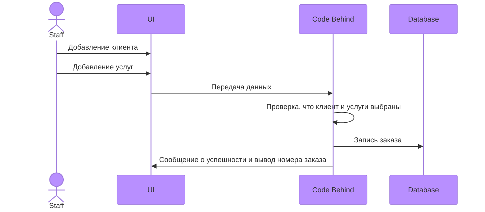

# ИС для сотрудников проката на Горнолыжном Курорте "Игора"
Выполнила Малышева Александра Юрьевна ИП 20-3
devklqedngvnqrekgb

## Диаграма Базы данных


Диаграмма последовательности для прецендента Формирование заказа
---


Скрипт
---
```
USE [ResortDB1]
GO
SET IDENTITY_INSERT [dbo].[Clients] ON 

INSERT [dbo].[Clients] ([Id], [KOD], [FIO], [Passport], [DateBirth], [Address], [Email], [Password]) VALUES (18, 45462526, N'Фролов Андрей Иванович', N'1180176596', CAST(N'2001-07-14T00:00:00.0000000+04:00' AS DateTimeOffset), N'344288, г. Санкт-Петербург, ул. Чехова, 1, кв. 34', N'gohufreilagrau-3818@yopmail.com', N'cl12345')
INSERT [dbo].[Clients] ([Id], [KOD], [FIO], [Passport], [DateBirth], [Address], [Email], [Password]) VALUES (19, 45462527, N'Николаев Даниил Всеволодович', N'2280223523', CAST(N'2001-02-10T00:00:00.0000000+03:00' AS DateTimeOffset), N'614164, г. Санкт-Петербург, ул. Степная, 30, кв. 75', N'xawugosune-1385@yopmail.com', N'cl12346')
INSERT [dbo].[Clients] ([Id], [KOD], [FIO], [Passport], [DateBirth], [Address], [Email], [Password]) VALUES (20, 45462528, N'Снегирев Макар Иванович', N'4560354155', CAST(N'1998-05-21T00:00:00.0000000+04:00' AS DateTimeOffset), N'394242, г. Санкт-Петербург, ул. Коммунистическая, 43, кв. 57', N'satrahuddusei-4458@yopmail.com', N'cl12347')
INSERT [dbo].[Clients] ([Id], [KOD], [FIO], [Passport], [DateBirth], [Address], [Email], [Password]) VALUES (21, 45462529, N'Иванов Иван Ильич', N'9120554296', CAST(N'1998-10-01T00:00:00.0000000+04:00' AS DateTimeOffset), N'660540, г. Санкт-Петербург, ул. Солнечная, 25, кв. 78', N'boippaxeufrepra-7093@yopmail.com', N'cl12348')
INSERT [dbo].[Clients] ([Id], [KOD], [FIO], [Passport], [DateBirth], [Address], [Email], [Password]) VALUES (22, 45462530, N'Филиппова Анна Глебовна', N'2367558134', CAST(N'1976-05-31T00:00:00.0000000+04:00' AS DateTimeOffset), N'125837, г. Санкт-Петербург, ул. Шоссейная, 40, кв. 92', N'zapramaxesu-7741@yopmail.com', N'cl12349')
INSERT [dbo].[Clients] ([Id], [KOD], [FIO], [Passport], [DateBirth], [Address], [Email], [Password]) VALUES (23, 45462531, N'Иванов Михаил Владимирович', N'7101669343', CAST(N'1985-11-04T00:00:00.0000000+03:00' AS DateTimeOffset), N'125703, г. Санкт-Петербург, ул. Партизанская, 49, кв. 84', N'rouzecroummegre-3899@yopmail.com', N'cl12350')
INSERT [dbo].[Clients] ([Id], [KOD], [FIO], [Passport], [DateBirth], [Address], [Email], [Password]) VALUES (24, 45462532, N'Власов Дмитрий Александрович', N'3455719630', CAST(N'1998-08-17T00:00:00.0000000+04:00' AS DateTimeOffset), N'625283, г. Санкт-Петербург, ул. Победы, 46, кв. 7', N'ziyeuddocrabri-4748@yopmail.com', N'cl12351')
INSERT [dbo].[Clients] ([Id], [KOD], [FIO], [Passport], [DateBirth], [Address], [Email], [Password]) VALUES (25, 45462533, N'Серова Екатерина Львовна', N'2377871623', CAST(N'1984-10-24T00:00:00.0000000+04:00' AS DateTimeOffset), N'614611, г. Санкт-Петербург, ул. Молодежная, 50, кв. 78', N'ketameissoinnei-1951@yopmail.com', N'cl12352')
INSERT [dbo].[Clients] ([Id], [KOD], [FIO], [Passport], [DateBirth], [Address], [Email], [Password]) VALUES (26, 45462534, N'Борисова Ирина Ивановна', N'8755921148', CAST(N'1976-10-14T00:00:00.0000000+04:00' AS DateTimeOffset), N'454311, г. Санкт-Петербург, ул. Новая, 19, кв. 78', N'yipraubaponou-5849@yopmail.com', N'cl12353')
INSERT [dbo].[Clients] ([Id], [KOD], [FIO], [Passport], [DateBirth], [Address], [Email], [Password]) VALUES (27, 45462535, N'Зайцев Никита Артёмович', N'4355104594', CAST(N'1999-10-14T00:00:00.0000000+04:00' AS DateTimeOffset), N'660007, г. Санкт-Петербург, ул. Октябрьская, 19, кв. 42', N'crapedocouca-3572@yopmail.com', N'cl12354')
INSERT [dbo].[Clients] ([Id], [KOD], [FIO], [Passport], [DateBirth], [Address], [Email], [Password]) VALUES (28, 45462536, N'Медведев Святослав Евгеньевич', N'2791114390', CAST(N'1985-07-13T00:00:00.0000000+04:00' AS DateTimeOffset), N'603036, г. Санкт-Петербург, ул. Садовая, 4, кв. 13', N'ceigoixakaunni-9227@yopmail.com', N'cl12355')
INSERT [dbo].[Clients] ([Id], [KOD], [FIO], [Passport], [DateBirth], [Address], [Email], [Password]) VALUES (29, 45462537, N'Коротков Кирилл Алексеевич', N'5582126286', CAST(N'1976-05-26T00:00:00.0000000+04:00' AS DateTimeOffset), N'450983, г. Санкт-Петербург, ул. Комсомольская, 26, кв. 60', N'yeimmeiwauzomo-7054@yopmail.com', N'cl12356')
INSERT [dbo].[Clients] ([Id], [KOD], [FIO], [Passport], [DateBirth], [Address], [Email], [Password]) VALUES (30, 45462538, N'Калашникова Арина Максимовна', N'2978133653', CAST(N'1999-08-13T00:00:00.0000000+04:00' AS DateTimeOffset), N'394782, г. Санкт-Петербург, ул. Чехова, 3, кв. 14', N'poleifenevi-1560@yopmail.com', N'cl12357')
INSERT [dbo].[Clients] ([Id], [KOD], [FIO], [Passport], [DateBirth], [Address], [Email], [Password]) VALUES (31, 45462539, N'Минина Таисия Кирилловна', N'7512141956', CAST(N'1985-10-13T00:00:00.0000000+04:00' AS DateTimeOffset), N'603002, г. Санкт-Петербург, ул. Дзержинского, 28, кв. 56', N'kauprezofautei-6607@yopmail.com', N'cl12358')
INSERT [dbo].[Clients] ([Id], [KOD], [FIO], [Passport], [DateBirth], [Address], [Email], [Password]) VALUES (32, 45462540, N'Наумов Серафим Романович', N'5046158433', CAST(N'1999-04-15T00:00:00.0000000+04:00' AS DateTimeOffset), N'450558, г. Санкт-Петербург, ул. Набережная, 30, кв. 71', N'quaffaullelourei-1667@yopmail.com', N'cl12359')
INSERT [dbo].[Clients] ([Id], [KOD], [FIO], [Passport], [DateBirth], [Address], [Email], [Password]) VALUES (33, 45462541, N'Воробьева Василиса Евгеньевна', N'2460169505', CAST(N'1999-01-13T00:00:00.0000000+03:00' AS DateTimeOffset), N'394060, г. Санкт-Петербург, ул. Фрунзе, 43, кв. 79', N'jsteele@rojas-robinson.net', N'cl12360')
INSERT [dbo].[Clients] ([Id], [KOD], [FIO], [Passport], [DateBirth], [Address], [Email], [Password]) VALUES (34, 45462542, N'Калинин Александр Андреевич', N'3412174593', CAST(N'1999-01-07T00:00:00.0000000+03:00' AS DateTimeOffset), N'410661, г. Санкт-Петербург, ул. Школьная, 50, кв. 53', N'vhopkins@lewis-mullen.com', N'cl12361')
INSERT [dbo].[Clients] ([Id], [KOD], [FIO], [Passport], [DateBirth], [Address], [Email], [Password]) VALUES (35, 45462543, N'Кузнецова Милана Владиславовна', N'4950183034', CAST(N'1999-01-24T00:00:00.0000000+03:00' AS DateTimeOffset), N'625590, г. Санкт-Петербург, ул. Коммунистическая, 20, кв. 34', N'nlewis@yahoo.com', N'cl12362')
INSERT [dbo].[Clients] ([Id], [KOD], [FIO], [Passport], [DateBirth], [Address], [Email], [Password]) VALUES (36, 45462544, N'Фирсов Егор Романович', N'5829219464', CAST(N'1993-09-02T00:00:00.0000000+04:00' AS DateTimeOffset), N'625683, г. Санкт-Петербург, ул. 8 Марта, 20, кв. 21', N'garciadavid@mckinney-mcbride.com', N'cl12363')
INSERT [dbo].[Clients] ([Id], [KOD], [FIO], [Passport], [DateBirth], [Address], [Email], [Password]) VALUES (37, 45462545, N'Зимина Агния Александровна', N'6443208059', CAST(N'1998-09-03T00:00:00.0000000+04:00' AS DateTimeOffset), N'400562, г. Санкт-Петербург, ул. Зеленая, 32, кв. 67', N'cbradley@castro.com', N'cl12364')
INSERT [dbo].[Clients] ([Id], [KOD], [FIO], [Passport], [DateBirth], [Address], [Email], [Password]) VALUES (38, 45462546, N'Титов Андрей Глебович', N'7079213265', CAST(N'1985-10-23T00:00:00.0000000+04:00' AS DateTimeOffset), N'614510, г. Санкт-Петербург, ул. Маяковского, 47, кв. 72', N'cuevascatherine@carlson.biz', N'cl12365')
INSERT [dbo].[Clients] ([Id], [KOD], [FIO], [Passport], [DateBirth], [Address], [Email], [Password]) VALUES (39, 45462547, N'Орлов Николай Егорович', N'8207522702', CAST(N'1985-07-27T00:00:00.0000000+04:00' AS DateTimeOffset), N'410542, г. Санкт-Петербург, ул. Светлая, 46, кв. 82', N'thomasmoore@wilson-singh.net', N'cl12366')
INSERT [dbo].[Clients] ([Id], [KOD], [FIO], [Passport], [DateBirth], [Address], [Email], [Password]) VALUES (40, 45462548, N'Кузнецова Аиша Михайловна', N'9307232158', CAST(N'1998-10-04T00:00:00.0000000+04:00' AS DateTimeOffset), N'620839, г. Санкт-Петербург, ул. Цветочная, 8, кв. 100', N'jessica84@hotmail.com', N'cl12367')
INSERT [dbo].[Clients] ([Id], [KOD], [FIO], [Passport], [DateBirth], [Address], [Email], [Password]) VALUES (41, 45462549, N'Куликов Никита Георгиевич', N'1357242839', CAST(N'1999-04-23T00:00:00.0000000+04:00' AS DateTimeOffset), N'443890, г. Санкт-Петербург, ул. Коммунистическая, 1, кв. 10', N'jessicapark@hotmail.com', N'cl12368')
INSERT [dbo].[Clients] ([Id], [KOD], [FIO], [Passport], [DateBirth], [Address], [Email], [Password]) VALUES (42, 45462550, N'Карпова София Егоровна', N'1167256636', CAST(N'1993-10-01T00:00:00.0000000+04:00' AS DateTimeOffset), N'603379, г. Санкт-Петербург, ул. Спортивная, 46, кв. 95', N'ginaritter@schneider-buchanan.com', N'cl12369')
INSERT [dbo].[Clients] ([Id], [KOD], [FIO], [Passport], [DateBirth], [Address], [Email], [Password]) VALUES (43, 45462551, N'Смирнова Дарья Макаровна', N'1768266986', CAST(N'1976-03-22T00:00:00.0000000+03:00' AS DateTimeOffset), N'603721, г. Санкт-Петербург, ул. Гоголя, 41, кв. 57', N'stephen99@yahoo.com', N'cl12370')
SET IDENTITY_INSERT [dbo].[Clients] OFF
GO
SET IDENTITY_INSERT [dbo].[Orders] ON 

INSERT [dbo].[Orders] ([Id], [KOD], [DateAdd], [ClientKod], [Status], [DateEnd], [TimeRental], [Client_Id], [TotalPrice]) VALUES (2, N'45462532/20.02.2024', CAST(N'2024-02-20T02:48:56.6912149+03:00' AS DateTimeOffset), N'45462532', 0, NULL, NULL, NULL, NULL)
SET IDENTITY_INSERT [dbo].[Orders] OFF
GO
SET IDENTITY_INSERT [dbo].[Services] ON 

INSERT [dbo].[Services] ([Id], [Name], [KOD], [Price], [Image]) VALUES (8, N'Прокат сноуборда', N'JUR8R', CAST(1200.00 AS Decimal(18, 2)), NULL)
INSERT [dbo].[Services] ([Id], [Name], [KOD], [Price], [Image]) VALUES (9, N'Прокат обуви для сноуборда', N'JKFBJ09', CAST(400.00 AS Decimal(18, 2)), NULL)
INSERT [dbo].[Services] ([Id], [Name], [KOD], [Price], [Image]) VALUES (10, N'Прокат салазок', N'DHBGFY563', CAST(450.00 AS Decimal(18, 2)), NULL)
INSERT [dbo].[Services] ([Id], [Name], [KOD], [Price], [Image]) VALUES (11, N'Прокат защитных подушек для сноубордистов', N'JFH7382', CAST(300.00 AS Decimal(18, 2)), NULL)
INSERT [dbo].[Services] ([Id], [Name], [KOD], [Price], [Image]) VALUES (12, N'Подъем на 1 уровень', N'JHVSJF6', CAST(300.00 AS Decimal(18, 2)), NULL)
INSERT [dbo].[Services] ([Id], [Name], [KOD], [Price], [Image]) VALUES (13, N'Подъем на 2  уровень', N'DJHGBS982', CAST(700.00 AS Decimal(18, 2)), NULL)
INSERT [dbo].[Services] ([Id], [Name], [KOD], [Price], [Image]) VALUES (14, N'Прокат очков для лыжников', N'OIJNB12', CAST(150.00 AS Decimal(18, 2)), NULL)
INSERT [dbo].[Services] ([Id], [Name], [KOD], [Price], [Image]) VALUES (15, N'Прокат санок', N'HJBUJE21J', CAST(300.00 AS Decimal(18, 2)), NULL)
INSERT [dbo].[Services] ([Id], [Name], [KOD], [Price], [Image]) VALUES (16, N'Прокат шлема', N'63748HF', CAST(300.00 AS Decimal(18, 2)), NULL)
INSERT [dbo].[Services] ([Id], [Name], [KOD], [Price], [Image]) VALUES (17, N'Прокат вартушки', N'BSFBHV63', CAST(100.00 AS Decimal(18, 2)), NULL)
INSERT [dbo].[Services] ([Id], [Name], [KOD], [Price], [Image]) VALUES (18, N'Подъем на 3 уровень', N'638VVNQ3', CAST(1200.00 AS Decimal(18, 2)), NULL)
INSERT [dbo].[Services] ([Id], [Name], [KOD], [Price], [Image]) VALUES (19, N'Прокат лыж', N'8HFJHG443', CAST(800.00 AS Decimal(18, 2)), NULL)
INSERT [dbo].[Services] ([Id], [Name], [KOD], [Price], [Image]) VALUES (20, N'Прокат лыжных палок', N'87FDJKHJ', CAST(100.00 AS Decimal(18, 2)), NULL)
SET IDENTITY_INSERT [dbo].[Services] OFF
GO
INSERT [dbo].[ServiceOrders] ([Service_Id], [Order_Id]) VALUES (8, 2)
INSERT [dbo].[ServiceOrders] ([Service_Id], [Order_Id]) VALUES (9, 2)
INSERT [dbo].[ServiceOrders] ([Service_Id], [Order_Id]) VALUES (14, 2)
INSERT [dbo].[ServiceOrders] ([Service_Id], [Order_Id]) VALUES (17, 2)
INSERT [dbo].[ServiceOrders] ([Service_Id], [Order_Id]) VALUES (18, 2)
GO
SET IDENTITY_INSERT [dbo].[EntryLogs] ON 

INSERT [dbo].[EntryLogs] ([Id], [DateLog], [StaffKod], [TypeEntry]) VALUES (14, CAST(N'2024-02-20T02:05:52.4930561+03:00' AS DateTimeOffset), N'саша', 0)
INSERT [dbo].[EntryLogs] ([Id], [DateLog], [StaffKod], [TypeEntry]) VALUES (15, CAST(N'2024-02-20T02:06:29.8856937+03:00' AS DateTimeOffset), N'саша', 0)
INSERT [dbo].[EntryLogs] ([Id], [DateLog], [StaffKod], [TypeEntry]) VALUES (16, CAST(N'2024-02-20T02:07:19.1425278+03:00' AS DateTimeOffset), N'саша', 0)
INSERT [dbo].[EntryLogs] ([Id], [DateLog], [StaffKod], [TypeEntry]) VALUES (17, CAST(N'2024-02-20T02:11:34.1990507+03:00' AS DateTimeOffset), N'саша', 0)
INSERT [dbo].[EntryLogs] ([Id], [DateLog], [StaffKod], [TypeEntry]) VALUES (18, CAST(N'2024-02-20T02:13:47.5619873+03:00' AS DateTimeOffset), N'саша', 0)
INSERT [dbo].[EntryLogs] ([Id], [DateLog], [StaffKod], [TypeEntry]) VALUES (19, CAST(N'2024-02-20T02:15:45.6529104+03:00' AS DateTimeOffset), N'саша', 0)
INSERT [dbo].[EntryLogs] ([Id], [DateLog], [StaffKod], [TypeEntry]) VALUES (20, CAST(N'2024-02-20T02:17:11.7463199+03:00' AS DateTimeOffset), N'саша', 1)
INSERT [dbo].[EntryLogs] ([Id], [DateLog], [StaffKod], [TypeEntry]) VALUES (21, CAST(N'2024-02-20T02:17:14.6011620+03:00' AS DateTimeOffset), N'саша', 0)
INSERT [dbo].[EntryLogs] ([Id], [DateLog], [StaffKod], [TypeEntry]) VALUES (22, CAST(N'2024-02-20T02:19:30.3415947+03:00' AS DateTimeOffset), N'саша', 0)
INSERT [dbo].[EntryLogs] ([Id], [DateLog], [StaffKod], [TypeEntry]) VALUES (23, CAST(N'2024-02-20T02:21:26.7326359+03:00' AS DateTimeOffset), N'саша', 0)
INSERT [dbo].[EntryLogs] ([Id], [DateLog], [StaffKod], [TypeEntry]) VALUES (24, CAST(N'2024-02-20T02:25:45.1966527+03:00' AS DateTimeOffset), N'саша', 0)
INSERT [dbo].[EntryLogs] ([Id], [DateLog], [StaffKod], [TypeEntry]) VALUES (25, CAST(N'2024-02-20T02:40:26.2110356+03:00' AS DateTimeOffset), N'mironov@namecomp.ru', 1)
INSERT [dbo].[EntryLogs] ([Id], [DateLog], [StaffKod], [TypeEntry]) VALUES (26, CAST(N'2024-02-20T02:40:28.6226334+03:00' AS DateTimeOffset), N'mironov@namecomp.ru', 0)
INSERT [dbo].[EntryLogs] ([Id], [DateLog], [StaffKod], [TypeEntry]) VALUES (27, CAST(N'2024-02-20T02:41:09.9474922+03:00' AS DateTimeOffset), N'Ivanov@namecomp.ru', 0)
INSERT [dbo].[EntryLogs] ([Id], [DateLog], [StaffKod], [TypeEntry]) VALUES (28, CAST(N'2024-02-20T02:41:35.5494414+03:00' AS DateTimeOffset), N'petrov@namecomp.ru', 0)
INSERT [dbo].[EntryLogs] ([Id], [DateLog], [StaffKod], [TypeEntry]) VALUES (29, CAST(N'2024-02-20T02:42:40.2174703+03:00' AS DateTimeOffset), N'fedorov@namecomp.ru', 0)
INSERT [dbo].[EntryLogs] ([Id], [DateLog], [StaffKod], [TypeEntry]) VALUES (30, CAST(N'2024-02-20T02:42:59.6239715+03:00' AS DateTimeOffset), N'shiryev@namecomp.ru', 0)
INSERT [dbo].[EntryLogs] ([Id], [DateLog], [StaffKod], [TypeEntry]) VALUES (31, CAST(N'2024-02-20T02:43:21.7502695+03:00' AS DateTimeOffset), N'smirnova@@namecomp.ru', 0)
INSERT [dbo].[EntryLogs] ([Id], [DateLog], [StaffKod], [TypeEntry]) VALUES (32, CAST(N'2024-02-20T11:15:44.1978429+03:00' AS DateTimeOffset), N'саша', 0)
INSERT [dbo].[EntryLogs] ([Id], [DateLog], [StaffKod], [TypeEntry]) VALUES (33, CAST(N'2024-02-20T11:33:28.1550158+03:00' AS DateTimeOffset), N'саша', 0)
INSERT [dbo].[EntryLogs] ([Id], [DateLog], [StaffKod], [TypeEntry]) VALUES (34, CAST(N'2024-02-20T11:34:25.1031463+03:00' AS DateTimeOffset), N'саша', 0)
INSERT [dbo].[EntryLogs] ([Id], [DateLog], [StaffKod], [TypeEntry]) VALUES (35, CAST(N'2024-02-20T11:34:49.5735008+03:00' AS DateTimeOffset), N'саша', 0)
INSERT [dbo].[EntryLogs] ([Id], [DateLog], [StaffKod], [TypeEntry]) VALUES (36, CAST(N'2024-02-20T11:40:26.6075915+03:00' AS DateTimeOffset), N'саша', 0)
INSERT [dbo].[EntryLogs] ([Id], [DateLog], [StaffKod], [TypeEntry]) VALUES (37, CAST(N'2024-02-20T11:41:34.7068497+03:00' AS DateTimeOffset), N'саша', 0)
INSERT [dbo].[EntryLogs] ([Id], [DateLog], [StaffKod], [TypeEntry]) VALUES (38, CAST(N'2024-02-20T11:42:06.3121628+03:00' AS DateTimeOffset), N'саша', 0)
INSERT [dbo].[EntryLogs] ([Id], [DateLog], [StaffKod], [TypeEntry]) VALUES (39, CAST(N'2024-02-20T11:42:47.6588328+03:00' AS DateTimeOffset), N'саша', 0)
SET IDENTITY_INSERT [dbo].[EntryLogs] OFF
GO
SET IDENTITY_INSERT [dbo].[Staffs] ON 

INSERT [dbo].[Staffs] ([Id], [Post], [FIO], [Login], [Password], [Image]) VALUES (1, 2, N'Малышева Александра Юрьевна', N'саша', N'саша', NULL)
INSERT [dbo].[Staffs] ([Id], [Post], [FIO], [Login], [Password], [Image]) VALUES (2, 0, N'Иванов Иван Иванович', N'Ivanov@namecomp.ru', N'2L6KZG', NULL)
INSERT [dbo].[Staffs] ([Id], [Post], [FIO], [Login], [Password], [Image]) VALUES (3, 0, N'Петров Петр Петрович', N'petrov@namecomp.ru', N'uzWC67', NULL)
INSERT [dbo].[Staffs] ([Id], [Post], [FIO], [Login], [Password], [Image]) VALUES (4, 2, N'Федоров Федор Федорович', N'fedorov@namecomp.ru', N'8ntwUp', NULL)
INSERT [dbo].[Staffs] ([Id], [Post], [FIO], [Login], [Password], [Image]) VALUES (5, 1, N'Миронов Вениамин Куприянович', N'mironov@namecomp.ru', N'YOyhfR', NULL)
INSERT [dbo].[Staffs] ([Id], [Post], [FIO], [Login], [Password], [Image]) VALUES (6, 1, N'Ширяев Ермолай Вениаминович', N'shiryev@namecomp.ru', N'RSbvHv', NULL)
INSERT [dbo].[Staffs] ([Id], [Post], [FIO], [Login], [Password], [Image]) VALUES (7, 1, N'Игнатов Кассиан Васильевич', N'ignatov@namecomp.ru', N'rwVDh9', NULL)
INSERT [dbo].[Staffs] ([Id], [Post], [FIO], [Login], [Password], [Image]) VALUES (8, 0, N'Хохлов Владимир Мэлсович', N'hohlov@namecomp.ru', N'LdNyos', NULL)
INSERT [dbo].[Staffs] ([Id], [Post], [FIO], [Login], [Password], [Image]) VALUES (9, 0, N'Стрелков Мстислав Георгьевич', N'strelkov@namecomp.ru', N'gynQMT', NULL)
INSERT [dbo].[Staffs] ([Id], [Post], [FIO], [Login], [Password], [Image]) VALUES (10, 0, N'Беляева Лилия Наумовна', N'belyeva@@namecomp.ru', N'AtnDjr', NULL)
INSERT [dbo].[Staffs] ([Id], [Post], [FIO], [Login], [Password], [Image]) VALUES (11, 0, N'Смирнова Ульяна Гордеевна', N'smirnova@@namecomp.ru', N'JlFRCZ', NULL)
SET IDENTITY_INSERT [dbo].[Staffs] OFF
GO

```